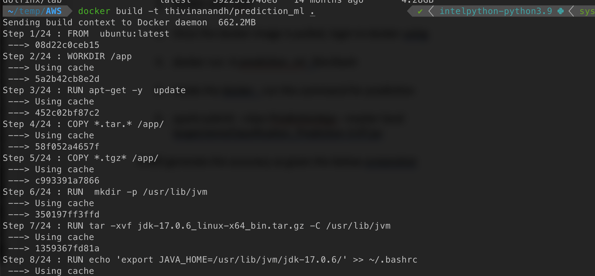
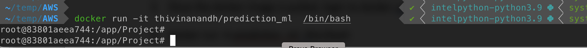
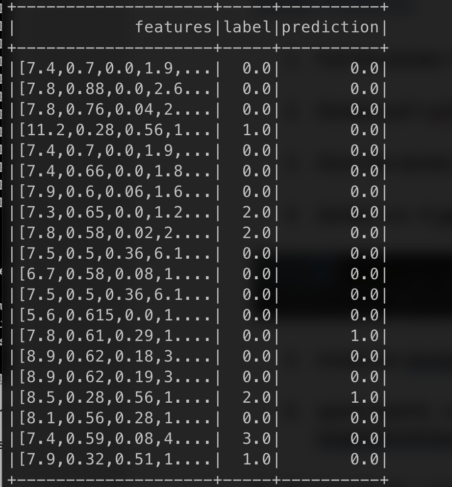
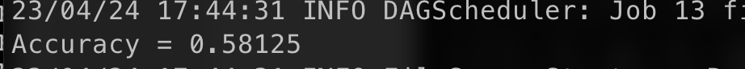

# Distributed training on AWS using spark and hadoop
---

A basic program which performs a distributed training using spark for a wine classification problem.

TO DEBUG: Currently the distributed training does not work when the number of nodes is greater than 2.

## Table of Contents 
1. [Setup on Master Node](#setup-on-master-node)
2. [Download JDK](#download-jdk)
3. [Set up scala](#set-up-scala)
4. [Setup Hadoop/spark](#setup-hadoopspark)
5. [Setup clusters information on master node](#setup-clusters-information-on-master-node)
6. [Starting spark](#starting-spark)
7. [Install Maven](#install-maven)
8. [Training on Node](#training-on-node)
9. [Code from local](#code-from-local)
10. [Code from Github](#code-from-github)
11. [Compile using maven](#compile-using-maven)
12. [Run the training](#run-the-training)
13. [Model Save](#model-save)
14. [Standalone Prediction](#standalone-prediction)
15. [Renaming pom.xml for prediction](#renaming-pomxml-for-prediction)
16. [Compile using maven](#compile-using-maven-1)
17. [Run the Prediction](#run-the-prediction)
18. [DOCKER -- PREDICTION](#docker-prediction)
19. [CREATING DOCKER](#creating-docker)
20. [Docker Prediction](#docker-prediction-1)

# Setup on Master Node:

## 1, Download JDK 

1.  Download jdk using the following command

2.  wget
    <https://download.oracle.com/java/17/archive/jdk-17.0.6_linux-x64_bin.tar.gz>

3.  Extract it to the /usr/lib/jvm folder using

4.  tar -xvf jdk-17.0.6_linux-x64_bin.tar.gz -C /usr/lib/jvm

5.  Setup Javahome and path variables

6.  export JAVA_HOME=/usr/lib/jvm/jdk-17.0.6/

7.  export
    PATH=\$PATH:/usr/lib/jvm/jdk-17.0.6/bin:/usr/local/spark/bin\'

## 2, Set up scala

Install scala using

Sudo apt-get scala

## 3, Setup Hadoop/spark

Install Hadoop using the file from the url

1.  wget
    <https://dlcdn.apache.org/spark/spark-3.3.2/spark-3.3.2-bin-hadoop3.tgz>

2.  extract it to spark-3.3.2-bin-hadoop3/ /usr/local/spark

3.  set up path variable

4.  export
    PATH=\$PATH:/usr/lib/jvm/jdk-17.0.6/bin:/usr/local/spark/bin\'

5.  setup config file at /us r/local/spark/conf

6.  Add the configuration to the spark-env file

7.  export SPARK_MASTER_HOST=172.31.39.218

8.  export JAVA_HOME=/usr/lib/jvm/jdk-17.0.6

## 4, Setup clusters information on master node

1.  Perform this setup on all clusters and gather all their ips

2.  Add the slave nodes information on the configuration file inside the
    conf directory

3.  \# A Spark Worker will be started on each of the machines listed
    below.

    a.  master

    b.  worker1

    c.  worker2

    d.  worker3

Note : make sure to map the ip's of the worker nodes to an alias as
described below in the /etc/hosts file

For Eg: 173.394.293.28 worker1

## 5, Starting spark 

To start spark run the following commands

Navigate to the /usr/local/sparkk/conf folder , from there run the file
called "start-all.sh"

Note : we can check the spark running on all clusters by looking at the
output of "jps"

## 6, Install Maven

Install maven using

Sudo apt install maven

# Training on Node:

## Code from local

1, Copy the code to the master instance using scp using following code

Scp -I "keyname" code_folder/ \<awsuser\>@\<awssystem\>:\~/Project/

## Code from Github

Pull the latest version of code from github using

Git pull \<github url for code\>

## Compile using maven

1.  get the xml file for training using

2.  cp pom_train.xml pom.xml

3.  then run the maven command using

4.  mvn clean package

5.  then the jar will be generated in the target folder

## Run the training 

To run the training, submit the job using the spark submit

spark-submit \--class ClassificationModel \--master
spark://172.31.39.218:7077 target/wineClassification-2.0T.jar

Note : Check the jar file name as given in the pom.xml file.

## Model Save

The model will be saved in the directory where the spark was executed

# Standalone Prediction

## Renaming pom.xml for prediction 

Rename the pom_pred.xml file to the pom.xml

## Compile using maven

1.  get the xml file for training using

2.  cp pom_train.xml pom.xml

3.  then run the maven command using

4.  mvn clean package

5.  then the jar will be generated in the target folder

## Run the Prediction 

To run the pred, submit the job using the spark submit

spark-submit \--class PredictionApp \--master local
target/wineClassification_Prediciton-3.0T.jar

# DOCKER -- PREDICTION

## CREATING DOCKER

FOR CREATING DOCKER image, use

docker build -t prediction_ml .

Note: the Dockerfile for this will be
```
COPY \*.tgz\* /app

RUN mkdir -p /usr/lib/jvm

RUN tar -xvf jdk-17.0.6_linux-x64_bin.tar.gz -C /usr/lib/jvm

RUN echo \'export JAVA_HOME=/usr/lib/jvm/jdk-17.0.6/\' \>\> \~/.bashrc

RUN echo \'export
PATH=\$PATH:/usr/lib/jvm/jdk-17.0.6/bin:/usr/local/spark/bin\'

ENV JAVA_HOME /usr/lib/jvm/jdk-17.0.6/

RUN export JAVA_HOME

ENV PATH \$PATH:/usr/lib/jvm/jdk-17.0.6/bin:/usr/local/spark/bin

RUN export PATH

RUN apt-get install -y scala

RUN tar -xvf spark-3.3.2-bin-hadoop3.tgz

RUN mv spark-3.3.2-bin-hadoop3/ /usr/local/spark

RUN apt install -y maven

RUN cp /usr/local/spark/conf/spark-env.sh.template
/usr/local/spark/conf/spark-env.sh

RUN echo \'export JAVA_HOME=/usr/lib/jvm/jdk-17.0.6\' \>\>
/usr/local/spark/conf/spark-env.sh

COPY classification_model /app/

COPY Project /app/Project

WORKDIR /app/Project

RUN apt install -y vim
```

Once the file is created, push it to the repo using

Docker push \<image name\>



## Docker Prediction

1.  Pull the docker image onto the ec2 instance using

2.  Docker pull \<url\>

3.  Once the docker image is pulled, login to docker using

4.  docker run -it prediction_ml /bin/bash



5.  inside the docker , run the command for prediction

6.  spark-submit \--class PredictionApp \--master local
    target/wineClassification_Prediciton-3.0T.jar

It will generate the accuracy as given the below screenshot




